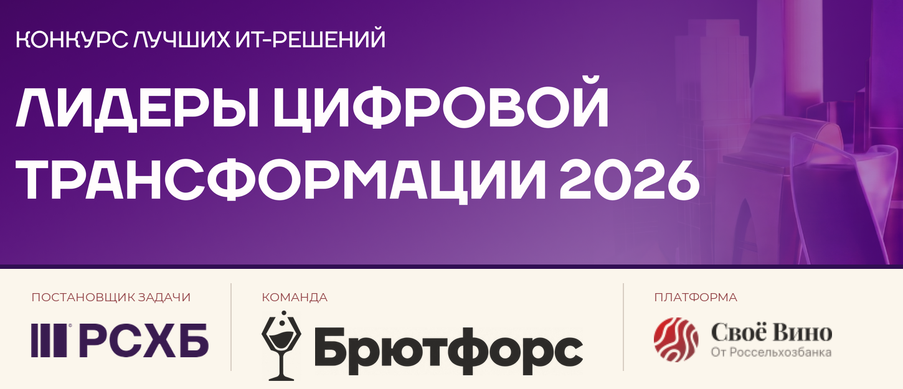
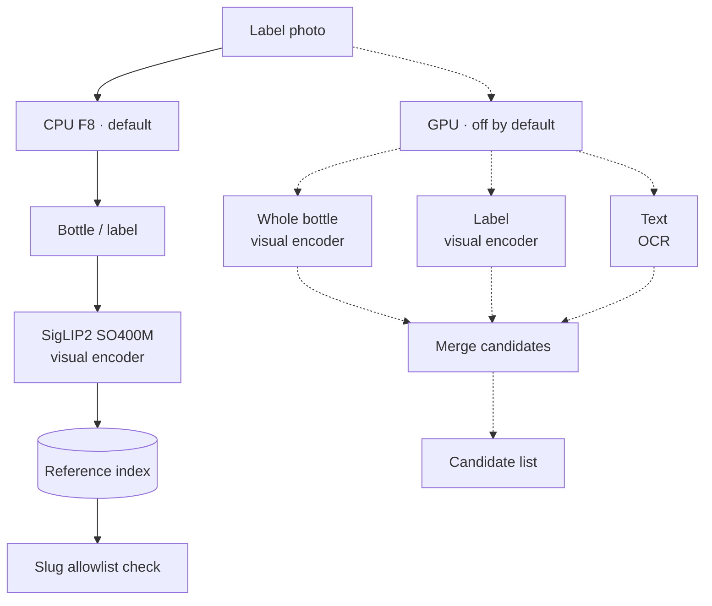
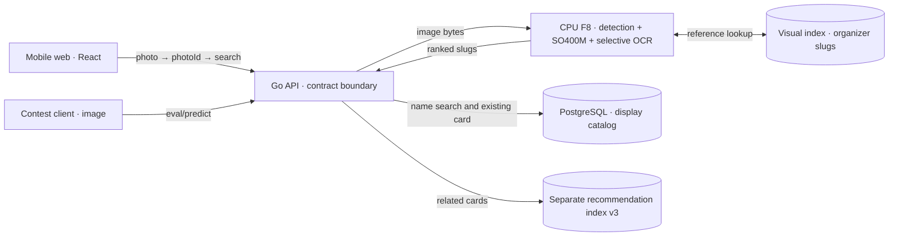
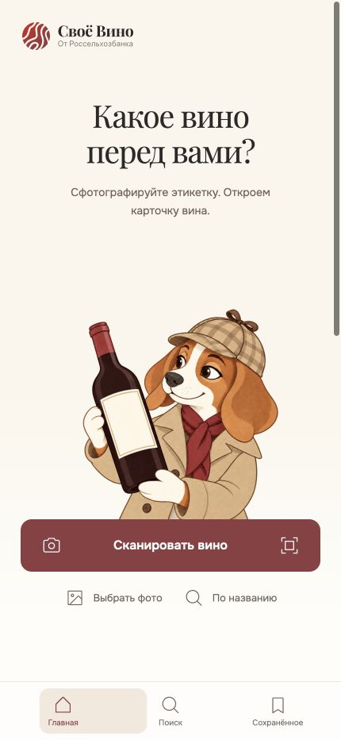
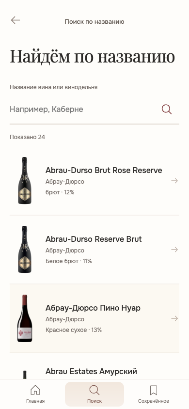
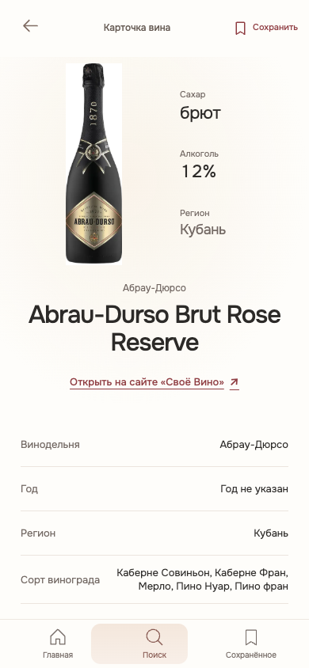
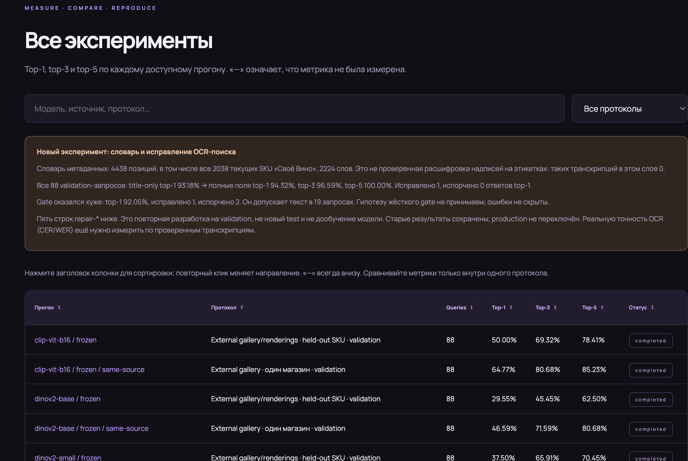
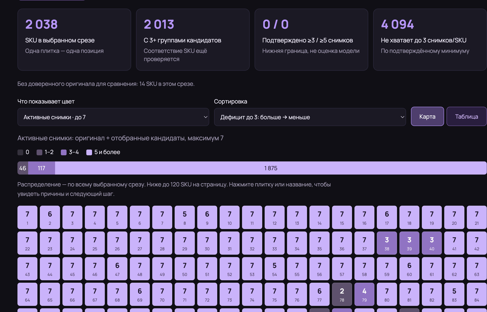
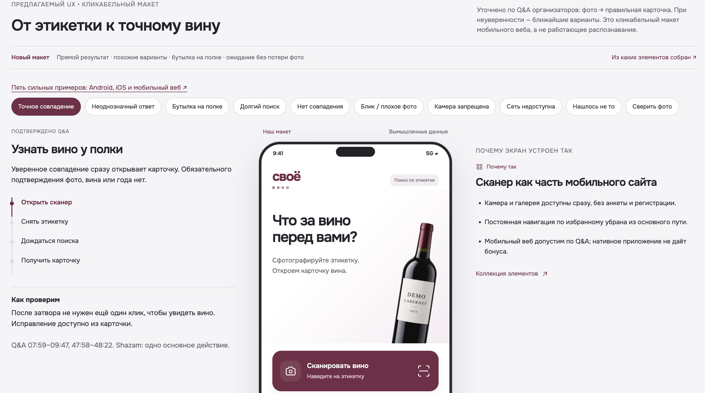
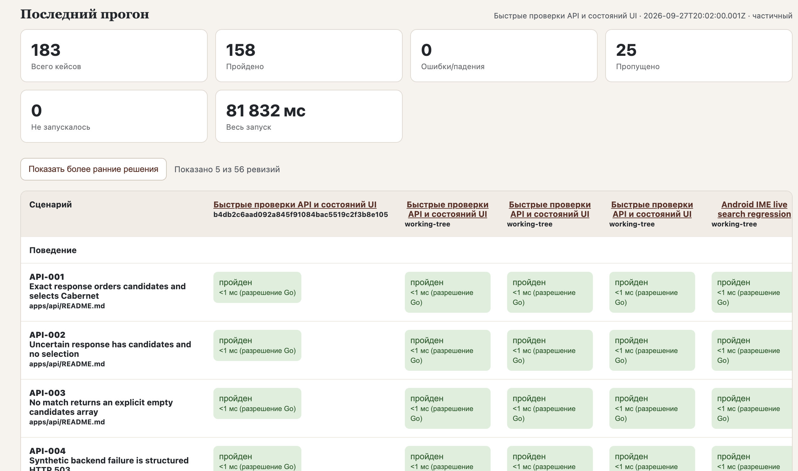

# BrutForce — Russian wine-label scanner

<p align="center">
  
</p>

BrutForce was built for the **Digital Transformation Leaders 2026** challenge from **Rosselkhozbank (RSHB)** for the Svoe Vino platform. The task is to find the exact Russian wine catalog entry from a label photo and open its card on a phone. Image recognition, catalog search, and a mobile web app work together. If the matching display card is missing, the app reports that outcome without substituting another wine.

The two photo-search paths have different APIs:

- **Organizer testing:** [`POST /v1/eval/predict`](https://app.dzap.pw/v1/eval/predict) receives the photo in `image` and returns a `slug` on a match.
- **In-app search:** [`POST /v1/photos`](https://app.dzap.pw/v1/photos) receives `photo`; [`POST /v1/search`](https://app.dzap.pw/v1/search) then accepts the `photoId` and returns candidates for the UI.

An organizer request example follows below.

**Project authors:** Maxim Popkov ([Telegram @skifmax](https://t.me/skifmax)) and Roman Karandashov ([GitHub MisterMolox](https://github.com/MisterMolox)). [Русский README](README.md).

## Contents

- [Quick start](#quick-start)
- [Supply your data](#supply-your-data)
- [Call the contest API](#call-the-contest-api)
- [Recognition model](#recognition-model)
- [Architecture at a glance](#architecture-at-a-glance)
- [Interface](#interface)
- [Research and development checks](#research-and-development-checks)
- [Links and limits](#links-and-limits)

## Quick start

Recognition requires Linux x86-64, Docker with Compose v2, and the [external data bundle](https://disk.yandex.ru/d/dHAXDPcitS-ZJQ). See the [host requirements (Russian)](docs/SELF-HOST.ru.md#полный-режим-с-docker). Clone the repository:

```sh
git clone https://github.com/ai-babai/brutforce.git
cd brutforce
```

Download all 14 files, verify SHA-256, and extract them into `$HOME/brutforce-local` using the [transfer guide (Russian)](docs/ASSET-TRANSFER.ru.md#как-восстановить-на-linux). From the repository root:

```sh
sh scripts/docker-local.sh init "$HOME/brutforce-local"
sh scripts/docker-local.sh up
sh scripts/docker-local.sh smoke
```

`init` creates local configuration and passwords. `up` checks the data and starts the full Compose stack. Open <http://127.0.0.1:8097/>. To stop: `sh scripts/docker-local.sh stop`; volumes persist.

For a UI-only demo, run `docker compose -f deploy/compose.demo.yaml up --build -d --wait` after cloning. This mode has eight sample cards; the contest API returns HTTP 503. See the [other launch options](docs/SELF-HOST.ru.md).

## Supply your data

Keep the extracted bundle **outside Git**, with `f8-bundle/`, `catalog-package/`, `catalog-media/`, and `recommendations/index.json` under the same data root. For another location, pass its absolute path to the **first** `sh scripts/docker-local.sh init /absolute/path/to/data`. This connects the directories and creates local secrets; `up` checks pinned versions and SHA-256.

A new wine catalog or set of reference photos requires matching visual-index data, allowed slugs, display package, and hashes. See the [data layout](docs/SELF-HOST.ru.md#данные-для-полного-режима) and [index rebuild limits](docs/ASSET-TRANSFER.ru.md#как-заново-построить-индексы). Send your **test photos** with the API request below; the model directory holds the pinned bundle.

## Call the contest API

To try the running service, send a label photo to [`https://app.dzap.pw/v1/eval/predict`](https://app.dzap.pw/v1/eval/predict) in one multipart field named `image`:

```sh
curl --fail-with-body --max-time 10 \
  -F 'image=@/path/to/your-label.jpg' \
  https://app.dzap.pw/v1/eval/predict
```

For a local full-stack installation, use `http://127.0.0.1:8097/v1/eval/predict`. Responses depend on the outcome:

- **Match:** HTTP 200 with `{"slug":"catalog-slug"}`.
- **No confirmed match:** HTTP 200 with `action` set to `no_match` or `insufficient_information`, and no `slug`.
- **Technical failure:** a different HTTP status. The model-free demo returns 503.

The local API needs no team token. The contest request uses `image`; the app's photo upload uses `photo`. See the [request and response contract](contracts/eval-predict.md).

In the app, `POST /v1/photos` stores the image and returns an `id`. Then `POST /v1/search` with JSON `{"photoId":"returned-id"}` returns candidates for the UI. Name search uses `GET /v2/catalog?q=...`. See the [interactive API docs](https://app.dzap.pw/api/docs) and the [application boundary](apps/api/README.md#boundary-and-contract).

## Recognition model

**Fast CPU — the default.** The F8 service handles label photos in TEST and PROD and returns a verified `slug`.

1. **Target in the photo.** RT-DETR finds the bottle; SigLIP2 Base helps check that it is wine. If no bottle is found, OWLv2 looks for a label. For a standalone label, the service may also inspect the full image.
2. **Visual comparison.** SigLIP2 SO400M is the visual encoder: it turns the selected region into a feature vector. The service ranks candidates against an index of reference photos.
3. **Response check.** On a borderline rejection, Tesseract OCR looks for wine words on the label. The resulting `slug` is checked against the organizer allowlist.

**GPU — an additional option when a graphics card is available.** A visual encoder processes the bottle and label separately, while OCR reads the text; the results are combined into a candidate list. GPU is off by default: a separate graphics-card service costs more to maintain. Connecting it to the app requires setup and verification.

> When a match remains uncertain, the API returns `no_match` or `insufficient_information`.



The solid path shows the running CPU service. The dotted path marks a GPU option for a separate deployment; automatic switching between profiles is not configured.

### Related wines

The v3 recommendation index selects related display cards using text, attributes, and winery. The app requests them through `/v1/recommendations` while viewing a wine.

[CPU F8 source](apps/vision/README.md) · [Model and data inventory](deploy/assets/INVENTORY.md) · [Detailed architecture](ARCHITECTURE.md#модель-и-поиск)

## Architecture at a glance



The contest API returns a verified organizer `slug` regardless of display-card availability. The app maps it to an existing card; if the card is missing, search reports `outside_display_catalog` and leaves the result without a replacement wine. Name search reads PostgreSQL without calling the model; recommendations read a separate index.

[Full architecture and photo flow](ARCHITECTURE.md)

## Interface

<p align="center">
  
  
  
</p>

The home screen with the sommelier mascot, catalog name search, and a wine card. These captures show interface screens. Evaluating recognition quality requires photos with known answers.

## Research and development checks

### Dataset and test baskets

To compare label-retrieval approaches, we assembled an image bank linked to SKUs and separate test baskets.

- [Roman's experiments journal](https://reps.roman.dzap.pw/#experiments) — protocols and top-1/top-3/top-5 results on validation and test sets.
- [Coverage map](https://reps.roman.dzap.pw/#coverage) — candidate groups and gaps in confirmed captures by SKU.

> Downloaded candidates still need verification as independent references. The journal reports experiment results; contest accuracy of the deployed service remains unknown.

<p align="center">
  <a href="docs/product/readme-research-experiments.jpg"></a>
  <a href="docs/product/readme-research-coverage.jpg"></a>
</p>

### UX research

The [reference atlas](https://reps.maks.dzap.pw/view#references) compares wine-app screens and user journeys. The [scenarios and prototype](https://reps.maks.dzap.pw/view#flows) show the proposed mobile-web design. The capture shows a prototype with fictional data; photo search is available in the [live app](https://app.dzap.pw).

### Behavior checks (BDD)

During agent-assisted development, we recorded scenarios for the API and UI states to catch regressions between revisions. The [behavior map](https://reps.maks.dzap.pw/behavior/) shows scenario statuses and run history. Fast checks use a stub recognizer; photo-search quality requires a separate evaluation.

<p align="center">
  <a href="docs/product/readme-ux-atlas.jpg"></a>
  <a href="docs/product/readme-behavior-bdd.jpg"></a>
</p>

*Screenshots show the reports at capture time; follow the links above for the latest data.*

## Links and limits

- [Live app](https://app.dzap.pw) · [repository](https://github.com/ai-babai/brutforce) · [documentation](docs/README.md) · [verification results](docs/SOLUTION.md).
- The contest artwork and RSHB mark come from the participant-provided “ЛЦТ2026 Шаблон презентации” template. The team mark uses concept 01 from an earlier set; the Svoe Vino logo comes from the app.
- The mascot home capture comes from an app design review; search and card captures come from the BrutForce mobile demo.
- The repository is public to read and clone; a code-reuse license has not been agreed separately. A presentation URL is not confirmed.
- Weights and data live outside Git. Public access to the bundle does not establish rights to redistribute models, the catalog, or photos.
- The full Compose health/catalog checks passed on Mac/OrbStack with linux/amd64 containers; clean-Linux and known-photo checks remain outstanding.
