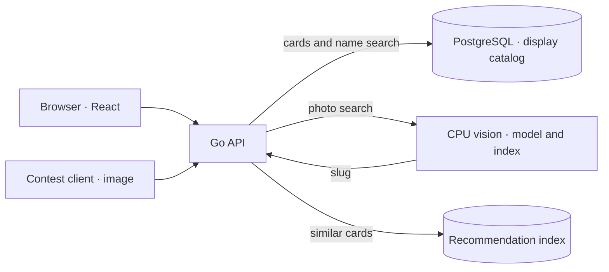

# BrutForce — Russian wine-label scanner

<p align="center">
  
</p>

Built for the **Digital Transformation Leaders 2026** challenge from **Rosselkhozbank (RSHB)** for the Svoe Vino platform. The task is to identify an exact Russian wine catalog entry from a label photo and show its card on a phone. The system combines image retrieval, a catalog and a mobile web application; it does not label an unrelated card as an exact match.

**Project authors:** Maxim Popkov ([Telegram @skifmax](https://t.me/skifmax)) and Roman Karandashov ([GitHub MisterMolox](https://github.com/MisterMolox)). [Русский README](README.md).

## Contents

- [Quick start](#quick-start)
- [Supply your data](#supply-your-data)
- [Call the contest API](#call-the-contest-api)
- [Architecture at a glance](#architecture-at-a-glance)
- [Interface](#interface)
- [Research and development checks](#research-and-development-checks)
- [Links and limits](#links-and-limits)

## Quick start

Recognition requires Linux x86-64, Docker with Compose v2, and the [external data bundle](https://disk.yandex.ru/d/dHAXDPcitS-ZJQ). See the [host requirements (Russian)](docs/SELF-HOST.ru.md#полный-режим-с-docker). Clone the repository:

```sh
git clone https://github.com/ai-babai/brutforce.git
cd brutforce
```

Download all 14 files, verify SHA-256, and extract them into `$HOME/brutforce-local` using the [transfer guide (Russian)](docs/ASSET-TRANSFER.ru.md#как-восстановить-на-linux). From the repository root:

```sh
sh scripts/docker-local.sh init "$HOME/brutforce-local"
sh scripts/docker-local.sh up
sh scripts/docker-local.sh smoke
```

`init` creates local configuration and passwords; `up` checks the data and starts the full Compose stack. Open <http://127.0.0.1:8097/>. Stop it with `sh scripts/docker-local.sh stop` (volumes persist).

For a UI-only demo after cloning, run `docker compose -f deploy/compose.demo.yaml up --build -d --wait`. It has eight sample cards but **no recognition: the contest API returns 503**. See the [other launch options](docs/SELF-HOST.ru.md).

## Supply your data

Keep the extracted bundle **outside Git**, with `f8-bundle/`, `catalog-package/`, `catalog-media/`, and `recommendations/index.json` under the same data root. To use another absolute path, pass it to the **first** `sh scripts/docker-local.sh init /absolute/path/to/data`. `up` checks pinned versions and SHA-256. Arbitrary new wine catalogs or reference-photo folders cannot be swapped in directly: the visual index, allowed slugs, display package, and hashes must agree. See the [data layout](docs/SELF-HOST.ru.md#данные-для-полного-режима) and [index rebuild limits](docs/ASSET-TRANSFER.ru.md#как-заново-построить-индексы). Send your **test photos** in the API request below, rather than copying them into the model directory.

## Call the contest API

After starting the full stack, send your label photo as exactly one multipart field named `image`:

```sh
curl --fail-with-body --max-time 10 \
  -F 'image=@/path/to/your-label.jpg' \
  http://127.0.0.1:8097/v1/eval/predict
```

A confirmed match returns HTTP 200 with `{"slug":"catalog-slug"}`. For `no_match` or `insufficient_information`, HTTP 200 carries `action` instead of a slug; technical errors use another status, and the data-free demo returns 503. No team token is needed locally. This endpoint accepts `image`, **not** the application's `/v1/photos` field `photo`. See the [request and response contract](contracts/eval-predict.md).

## Architecture at a glance



The app uses `/v1/photos` followed by `/v1/search` with a `photoId`. A recognized organizer slug without a matching display card is not replaced by an unrelated wine. CPU serving source is in [apps/vision/](apps/vision/README.md). See the [full architecture](ARCHITECTURE.md).

## Interface

<p align="center">
  
  
  
</p>

The home screen with the sommelier mascot, catalog name search, and a wine card. These screens show the interface, not measured label-recognition quality.

## Research and development checks

**Dataset and test baskets.** To research label-based retrieval, we assembled an SKU-linked image bank and separate test baskets for comparing approaches. [Roman's experiments journal](https://reps.roman.dzap.pw/#experiments) lists protocols and top-1/top-3/top-5 results on validation and test sets; the [coverage map](https://reps.roman.dzap.pw/#coverage) shows candidate groups and gaps in confirmed captures by SKU. Downloaded candidates are not automatically verified independent references. Results from individual experiments are not the contest accuracy of the deployed service.

<p align="center">
  <a href="docs/product/readme-research-experiments.jpg"></a>
  <a href="docs/product/readme-research-coverage.jpg"></a>
</p>

**UX research.** The [reference atlas](https://reps.maks.dzap.pw/view#references) compares wine-app screens and user journeys; the [scenarios and prototype](https://reps.maks.dzap.pw/view#flows) show the proposed mobile-web design. The capture below is a research prototype using fictional data, not a functioning scanner.

**BDD coverage.** During agent-assisted development, we captured the expected API and UI-state behavior as scenarios and checked them across revisions to catch regressions. The [behavior map](https://reps.maks.dzap.pw/behavior/) shows scenario statuses and run history. These fast checks use a stub recognizer and do not measure photo-search quality.

<p align="center">
  <a href="docs/product/readme-ux-atlas.jpg"></a>
  <a href="docs/product/readme-behavior-bdd.jpg"></a>
</p>

Screenshots are snapshots; follow the linked reports for the latest data and details.

## Links and limits

- [Live app](https://app.dzap.pw) · [repository](https://github.com/ai-babai/brutforce) · [documentation](docs/README.md) · [verification results](docs/SOLUTION.md).
- The contest artwork and RSHB mark come from the participant-provided “ЛЦТ2026 Шаблон презентации” template; the team mark uses the previously favored concept 01, and the Svoe Vino logo comes from the app. The mascot home screen is from an app design review; search and card captures are from the BrutForce mobile demo.
- The repository is currently private; cloning requires access. A presentation URL is not confirmed.
- Weights and data are outside Git. Public access does not establish redistribution rights. Full Compose health/catalog checks passed on Mac/OrbStack with linux/amd64 containers; clean-Linux and known-photo checks remain outstanding.
