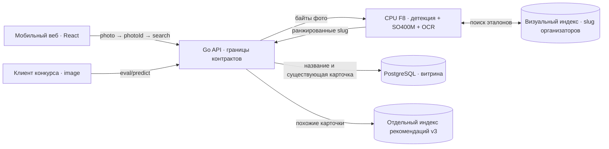

# BrutForce — сканер российских вин

<p align="center">
  
</p>

BrutForce — проект команды соревнования **«Лидеры цифровой трансформации — 2026»** по кейсу **Россельхозбанка (РСХБ)** для платформы «Своё Вино». Задача — найти точную запись в каталоге российских вин по фото этикетки и открыть её карточку на телефоне. Для этого работают распознавание изображения, каталог и мобильное веб-приложение. Если подтверждённой карточки нет, приложение сообщает об этом и оставляет результат без подмены.

Для двух способов поиска предусмотрены разные API:

- **Проверка организаторов:** [`POST /v1/eval/predict`](https://app.dzap.pw/v1/eval/predict) получает фото в поле `image` и при совпадении возвращает `slug`.
- **Поиск в приложении:** [`POST /v1/photos`](https://app.dzap.pw/v1/photos) получает фото в поле `photo`, затем [`POST /v1/search`](https://app.dzap.pw/v1/search) принимает `photoId` и возвращает кандидатов для интерфейса.

Пример запроса для организаторов приведён ниже.

**Авторы проекта:** Максим Попков ([Telegram @skifmax](https://t.me/skifmax)) и Роман Карандашов ([GitHub MisterMolox](https://github.com/MisterMolox)). [English](README.en.md).

## Содержание

- [Быстрый запуск](#быстрый-запуск)
- [Как подложить свои данные](#как-подложить-свои-данные)
- [Как вызвать конкурсный API](#как-вызвать-конкурсный-api)
- [Модель распознавания](#модель-распознавания)
- [Краткая архитектура](#краткая-архитектура)
- [Интерфейс](#интерфейс)
- [Исследования и проверки разработки](#исследования-и-проверки-разработки)
- [Материалы и ограничения](#материалы-и-ограничения)

## Быстрый запуск

Для распознавания этикетки нужны Linux x86-64, Docker с Compose v2 и [внешний комплект данных](https://disk.yandex.ru/d/dHAXDPcitS-ZJQ). Требования к памяти и диску — в [руководстве по запуску](docs/SELF-HOST.ru.md#полный-режим-с-docker). Клонируйте репозиторий:

```sh
git clone https://github.com/ai-babai/brutforce.git
cd brutforce
```

Скачайте все 14 файлов комплекта, проверьте SHA-256 и распакуйте их в `$HOME/brutforce-local` [по инструкции](docs/ASSET-TRANSFER.ru.md#как-восстановить-на-linux). Из корня клона выполните:

```sh
sh scripts/docker-local.sh init "$HOME/brutforce-local"
sh scripts/docker-local.sh up
sh scripts/docker-local.sh smoke
```

`init` создаёт локальную конфигурацию и пароли. `up` проверяет файлы и запускает полный Compose. Откройте <http://127.0.0.1:8097/>. Остановка: `sh scripts/docker-local.sh stop`; данные в volumes сохраняются.

Для интерфейса без модели после клонирования запустите `docker compose -f deploy/compose.demo.yaml up --build -d --wait`. В этом режиме доступны восемь пробных карточек; конкурсный API отвечает HTTP 503. [Другие способы запуска](docs/SELF-HOST.ru.md).

## Как подложить свои данные

Разместите распакованный комплект **вне Git** в одном каталоге:

```text
~/brutforce-local/
├── f8-bundle/                 веса, OCR, визуальный индекс и slug организаторов
├── catalog-package/           карточки витрины и manifest
├── catalog-media/             изображения карточек
└── recommendations/index.json отдельный индекс рекомендаций
```

Для другого расположения данных передайте абсолютный путь при **первом** `sh scripts/docker-local.sh init /absolute/path/to/data`. Команда подключит каталоги и создаст локальные секреты; `up` сверит версии и SHA.

Новый каталог вин или набор эталонных фото потребует согласованных визуального индекса, списка `slug`, пакета каталога и контрольных сумм. [Формат данных](docs/SELF-HOST.ru.md#данные-для-полного-режима) · [пересборка индексов](docs/ASSET-TRANSFER.ru.md#как-заново-построить-индексы). Собственные **фото для проверки** отправляйте запросом к API ниже; каталог модели предназначен для закреплённого комплекта.

## Как вызвать конкурсный API

Для проверки работающего сервиса отправьте фото этикетки на [`https://app.dzap.pw/v1/eval/predict`](https://app.dzap.pw/v1/eval/predict) в одном multipart-поле `image`:

```sh
curl --fail-with-body --max-time 10 \
  -F 'image=@/path/to/your-label.jpg' \
  https://app.dzap.pw/v1/eval/predict
```

Для локального полного режима замените адрес на `http://127.0.0.1:8097/v1/eval/predict`. Ответ зависит от результата:

- **Совпадение:** HTTP 200 и `{"slug":"catalog-slug"}`.
- **Нет подтверждённого совпадения:** HTTP 200 с полем `action` (`no_match` или `insufficient_information`), без `slug`.
- **Техническая ошибка:** другой HTTP-статус. Демо без модели отвечает 503.

Локальному API токен не требуется. Конкурсный запрос использует поле `image`; загрузка в приложении — `photo`. [Формат, лимиты и ответы](contracts/eval-predict.md).

В приложении `POST /v1/photos` сохраняет фото и возвращает `id`. Затем `POST /v1/search` с JSON `{"photoId":"полученный-id"}` выдаёт кандидатов для интерфейса. Для поиска по названию служит `GET /v2/catalog?q=...`. [Интерактивная документация API](https://app.dzap.pw/api/docs) · [границы приложения](apps/api/README.md#boundary-and-contract).

## Модель распознавания

Сервис CPU F8 сопоставляет фото этикетки с каталогом организаторов. При совпадении он возвращает `slug` — идентификатор вина.

1. **Область этикетки.** RT-DETR и OWLv2 помогают найти бутылку и этикетку. Для сложных кадров сервис также проверяет изображение целиком.
2. **Визуальное сходство.** SigLIP2 SO400M строит числовой вектор изображения. По нему сервис ищет похожие записи в индексе признаков эталонных фото.
3. **Проверка ответа.** OCR и текстовое подтверждение помогают разобрать неоднозначные надписи. Итоговый `slug` сверяется со списком допустимых идентификаторов.

> Если совпадение не подтверждено, API возвращает `no_match` или `insufficient_information`.

### Похожие вина

Индекс рекомендаций v3 подбирает близкие карточки витрины по тексту, характеристикам и винодельне. Приложение запрашивает их через `/v1/recommendations` при просмотре вина.

[Код CPU F8](apps/vision/README.md) · [Состав модели и данных](deploy/assets/INVENTORY.md) · [Подробная архитектура](ARCHITECTURE.md#модель-и-поиск)

## Краткая архитектура



Конкурсный API возвращает проверенный `slug` независимо от наличия карточки в витрине. Приложение связывает `slug` с существующей карточкой; при её отсутствии поиск сообщает `outside_display_catalog` и не подменяет результат другим вином. Поиск по названию читает PostgreSQL без обращения к модели, рекомендации — отдельный индекс.

[Полная схема и путь фотографии](ARCHITECTURE.md)

## Интерфейс

<p align="center">
  
  
  
</p>

Главная с маскотом-сомелье, поиск по названию и карточка вина. Снимки показывают экраны интерфейса. Для оценки качества распознавания нужны фотографии с известным ответом.

## Исследования и проверки разработки

### Датасет и тестовые корзины

Для сравнения подходов к поиску по этикетке собрали банк изображений с привязкой к SKU и отдельные тестовые корзины.

- [Журнал экспериментов Романа](https://reps.roman.dzap.pw/#experiments) — протоколы и top-1/top-3/top-5 для validation и test.
- [Карта покрытия](https://reps.roman.dzap.pw/#coverage) — группы кандидатов и нехватка подтверждённых снимков по SKU.

> Скачанные кандидаты ещё требуют проверки как независимые эталоны. Цифры из журнала относятся к экспериментам; конкурсная точность развёрнутого сервиса пока неизвестна.

<p align="center">
  <a href="docs/product/readme-research-experiments.jpg"></a>
  <a href="docs/product/readme-research-coverage.jpg"></a>
</p>

### UX-исследование

В [атласе референсов](https://reps.maks.dzap.pw/view#references) разобраны экраны винных приложений и пользовательские сценарии. [Сценарии и макет](https://reps.maks.dzap.pw/view#flows) показывают решения для мобильного веба. На снимке — макет с вымышленными данными; поиск по фото доступен в [работающем приложении](https://app.dzap.pw).

### Проверки поведения (BDD)

В ходе разработки с участием агентов записывали сценарии для API и состояний UI. Они помогают замечать регрессии между ревизиями. [Карта поведения](https://reps.maks.dzap.pw/behavior/) показывает статусы сценариев и историю прогонов. В быстрых проверках работает подменённый распознаватель; качество поиска по фото требует отдельной оценки.

<p align="center">
  <a href="docs/product/readme-ux-atlas.jpg"></a>
  <a href="docs/product/readme-behavior-bdd.jpg"></a>
</p>

*Скриншоты фиксируют состояние отчётов на момент съёмки; актуальные данные доступны по ссылкам выше.*

## Материалы и ограничения

- [Работающий прототип](https://app.dzap.pw) · [репозиторий](https://github.com/ai-babai/brutforce) · [документация](docs/README.md) · [результаты проверок](docs/SOLUTION.md).
- Титульная графика и знак РСХБ взяты из предоставленного участникам шаблона «ЛЦТ2026 Шаблон презентации». Знак команды — вариант № 01 из предыдущей подборки; логотип «Своё Вино» — из приложения.
- Снимок главной с маскотом сделан во время дизайн-проверки; поиск и карточка — в мобильном демо BrutForce.
- Репозиторий открыт для чтения и клонирования; лицензия на повторное использование кода отдельно не утверждена. Ссылка на презентацию пока не подтверждена.
- Веса и данные хранятся вне Git. Публичная доступность комплекта не подтверждает права распространять модели, каталог и фотографии.
- Полный Compose прошёл проверку health/catalog на Mac/OrbStack (linux/amd64); запуск на чистом Linux и распознавание по известному фото ещё ждут проверки.
