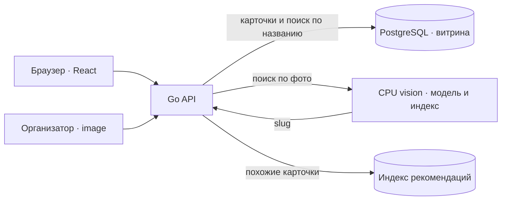

# BrutForce — сканер российских вин

<p align="center">
  
</p>

Проект команды соревнования **«Лидеры цифровой трансформации — 2026»** по кейсу **Россельхозбанка (РСХБ)** для платформы «Своё Вино». Задача — по фотографии этикетки найти точную запись в каталоге российских вин и открыть её карточку на телефоне. Решение сочетает распознавание изображения, поиск по каталогу и мобильное веб-приложение. При отсутствии подтверждённой карточки приложение не выдаёт другое вино за точное совпадение.

**Авторы проекта:** Максим Попков ([Telegram @skifmax](https://t.me/skifmax)) и Роман Карандашов ([GitHub MisterMolox](https://github.com/MisterMolox)). [English](README.en.md).

## Содержание

- [Быстрый запуск](#быстрый-запуск)
- [Как подложить свои данные](#как-подложить-свои-данные)
- [Как вызвать конкурсный API](#как-вызвать-конкурсный-api)
- [Краткая архитектура](#краткая-архитектура)
- [Интерфейс](#интерфейс)
- [Исследования и проверки разработки](#исследования-и-проверки-разработки)
- [Материалы и ограничения](#материалы-и-ограничения)

## Быстрый запуск

Для распознавания этикетки нужны Linux x86-64, Docker с Compose v2 и [внешний комплект данных](https://disk.yandex.ru/d/dHAXDPcitS-ZJQ). Требования к памяти и диску — в [руководстве по запуску](docs/SELF-HOST.ru.md#полный-режим-с-docker). Клонируйте репозиторий:

```sh
git clone https://github.com/ai-babai/brutforce.git
cd brutforce
```

Скачайте все 14 файлов комплекта, проверьте SHA-256 и распакуйте их в `$HOME/brutforce-local` [по инструкции](docs/ASSET-TRANSFER.ru.md#как-восстановить-на-linux). Из корня клона выполните:

```sh
sh scripts/docker-local.sh init "$HOME/brutforce-local"
sh scripts/docker-local.sh up
sh scripts/docker-local.sh smoke
```

`init` создаёт локальную конфигурацию и пароли; `up` уже проверяет файлы и запускает полный Compose. Откройте <http://127.0.0.1:8097/>. Для остановки: `sh scripts/docker-local.sh stop` (данные в volumes сохраняются).

Нужен только интерфейс без модели? После клонирования выполните `docker compose -f deploy/compose.demo.yaml up --build -d --wait`. Это демо с восемью пробными карточками: **конкурсный API вернёт 503, а не результат распознавания**. [Другие способы запуска](docs/SELF-HOST.ru.md).

## Как подложить свои данные

Разместите распакованный комплект **вне Git** в одном каталоге:

```text
~/brutforce-local/
├── f8-bundle/                 веса, OCR, визуальный индекс и slug организаторов
├── catalog-package/           карточки витрины и manifest
├── catalog-media/             изображения карточек
└── recommendations/index.json отдельный индекс рекомендаций
```

Если используете другой путь, укажите его при **первом** `sh scripts/docker-local.sh init /absolute/path/to/data`. Скрипт подключит эти каталоги и создаст локальные секреты; `up` сверит зафиксированные версии и SHA. Произвольный новый каталог вин или папку с эталонными фото просто подставить нельзя: понадобятся согласованные визуальный индекс, список slug, пакет каталога и контрольные суммы. [Формат и ограничения](docs/SELF-HOST.ru.md#данные-для-полного-режима) · [пересборка индексов](docs/ASSET-TRANSFER.ru.md#как-заново-построить-индексы). Свои **фото для проверки** передавайте в запросе API ниже, не копируйте в каталог модели.

## Как вызвать конкурсный API

После запуска полного режима отправьте своё фото этикетки как **одно** multipart-поле `image`:

```sh
curl --fail-with-body --max-time 10 \
  -F 'image=@/path/to/your-label.jpg' \
  http://127.0.0.1:8097/v1/eval/predict
```

При подтверждённом совпадении ответ — HTTP 200 и `{"slug":"catalog-slug"}`. При `no_match` или `insufficient_information` API возвращает HTTP 200 с полем `action` вместо slug; техническая ошибка даёт другой статус, демо без модели — 503. Токен для локального API не нужен. Здесь используется `image`, **не** поле `photo` из пользовательского `/v1/photos`. [Формат, лимиты и ответы](contracts/eval-predict.md).

## Краткая архитектура



Приложение загружает фото через `/v1/photos` и ищет по `photoId` через `/v1/search`; если у slug нет карточки витрины, чужое вино не подставляется. Код CPU-сервиса — в [apps/vision/](apps/vision/README.md). [Полная схема](ARCHITECTURE.md).

## Интерфейс

<p align="center">
  
  
  
</p>

Главная с маскотом-сомелье, поиск по названию и карточка вина. Эти экраны показывают интерфейс, а не качество распознавания этикеток.

## Исследования и проверки разработки

**Датасет и тестовые корзины.** Для исследования поиска по этикетке собрали банк изображений по SKU и отдельные тестовые корзины для сравнения подходов. [Журнал экспериментов Романа](https://reps.roman.dzap.pw/#experiments) показывает протоколы и top-1/top-3/top-5 для validation и test; [карта покрытия](https://reps.roman.dzap.pw/#coverage) — группы кандидатов и нехватку подтверждённых снимков по SKU. Скачанные кандидаты ещё не считаются проверенными независимыми референсами. Метрики отдельных экспериментов не являются конкурсной точностью развёрнутого сервиса.

<p align="center">
  <a href="docs/product/readme-research-experiments.jpg"></a>
  <a href="docs/product/readme-research-coverage.jpg"></a>
</p>

**UX-исследование.** В [атласе референсов](https://reps.maks.dzap.pw/view#references) разбирали экраны винных приложений и пользовательские сценарии; [сценарии и макет](https://reps.maks.dzap.pw/view#flows) показывают, какие решения предложили для мобильного веба. На снимке — исследовательский макет с вымышленными данными, не работающий сканер.

**BDD-покрытие.** При разработке агентами фиксировали ожидаемое поведение API и состояния UI в сценариях и проверяли его между ревизиями, чтобы замечать регрессии. [Карта поведения](https://reps.maks.dzap.pw/behavior/) показывает статус каждого сценария и историю прогонов. Быстрые проверки используют подменённый распознаватель и не измеряют качество поиска по фото.

<p align="center">
  <a href="docs/product/readme-ux-atlas.jpg"></a>
  <a href="docs/product/readme-behavior-bdd.jpg"></a>
</p>

Скриншоты — снимки отчётов; актуальные данные и подробности доступны по ссылкам выше.

## Материалы и ограничения

- [Работающий прототип](https://app.dzap.pw) · [репозиторий](https://github.com/ai-babai/brutforce) · [документация](docs/README.md) · [результаты проверок](docs/SOLUTION.md).
- Титульная графика и знак РСХБ — из шаблона «ЛЦТ2026 Шаблон презентации», предоставленного участникам; знак команды — ранее понравившийся вариант № 01, логотип «Своё Вино» — из приложения. Главная с маскотом — из дизайн-проверки, поиск и карточка — из мобильного демо BrutForce.
- Репозиторий сейчас приватный: для клонирования нужен доступ. Ссылка на презентацию пока не подтверждена.
- Веса и данные не входят в Git. Публичный доступ к комплекту не подтверждает право распространять модели, каталог и фотографии. Полный Compose проверен на Mac/OrbStack (linux/amd64); отдельный запуск на чистом Linux с известным фото ещё не подтверждён.
